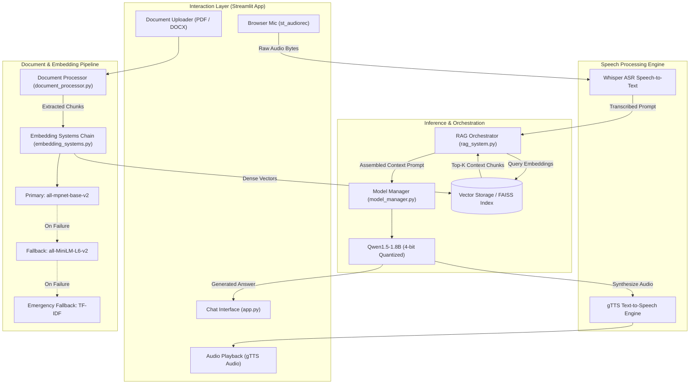
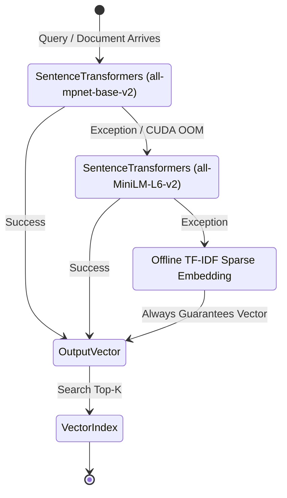

<br/><br/>

<!-- Animated Title -->
<p align="center">
  <a href="#">
    
  </a>
</p>

<p align="center">
  <b>Production-Grade Multimodal Voice & Document RAG Platform with Adaptive Embedding Failover</b><br/>
  <i>Speech-to-Text Transcription · High-Fidelity Vector Retrieval · Quantized LLM Generation · Multilingual Speech Synthesis · Resilient Ingestion</i>
</p>

<br/>

<!-- Badges Row 1: Core AI & Models -->
<p align="center">
  
  
  
  
  
</p>

<!-- Badges Row 2: Retrieval & Vector Infrastructure -->
<p align="center">
  
  
  
  
  
</p>

<!-- Badges Row 3: Standards & Deployment -->
<p align="center">
  
  
  
  
</p>

<br/>

<!-- Quick Navigation Bar -->
<p align="center">
  <a href="#-overview"></a>
  &nbsp;
  <a href="#-problem-statement--solution"></a>
  &nbsp;
  <a href="#-multimodal-features"></a>
  &nbsp;
  <a href="#%EF%B8%8F-system-architecture"></a>
  &nbsp;
  <a href="#-rag--embedding-resilience-pipeline"></a>
  &nbsp;
  <a href="#-technical-stack"></a>
  &nbsp;
  <a href="#-quickstart--execution"></a>
</p>

---

## 📌 Overview

**MR-NLP Robust RAG Chatbot** is an enterprise-grade multimodal Conversational AI system combining **real-time voice interaction (ASR & TTS)** with **evidence-grounded document intelligence (Retrieval-Augmented Generation)**. Engineered to operate under strict computational constraints and unstable remote connectivity, the architecture guarantees continuous availability through **multi-tier embedding fallback chains** and **4-bit quantized local language model inference**.

Users can speak into their microphone or submit unstructured text documents (PDFs, Word documents, text transcripts). The system transcribes audio via OpenAI's **Whisper**, retrieves relevant factual context using **SentenceTransformers**, synthesizes grounded answers with **Qwen1.5-1.8B**, and responds back in synthesized speech across multiple international languages.

```
                        ┌────────────────────────────────────────────────────────┐
                        │             MR-NLP Robust RAG Core                     │
                        │                                                        │
[ Microphone Audio / ]──┼──> [ Whisper ASR ] ──> Query Vectorizer ─────────────┼──> [ Multimodal Output ]
[ PDF / DOCX Docs    ]  │             │                                          │    - Streamlit Chat Answer
                        │             ▼                                          │    - gTTS Audio Speech
                        │    [ Resilient Vector Store ] ──> Context Extraction   │    - Source Document Badges
                        │             │                     (Top-K Chunks)       │    - Relevance Cosine Scores
                        │             ▼                                          │
                        │    [ Qwen 1.5-1.8B LLM ]    ──> Quantized Synthesis    │
                        └────────────────────────────────────────────────────────┘
```

---

## 🎯 Problem Statement & Solution

<table>
<tr>
<td width="50%" valign="top">

### ❌ The Brittle RAG Bottleneck

Traditional RAG implementations suffer from operational fragility:

- 🛑 **Single Point of Failure (SPOF) on Embeddings**: If a remote embedding API encounters rate limits or downtime, the entire chatbot crashes.
- 🐌 **Heavy Compute Footprint**: Large 70B+ parameter models require prohibitive multi-GPU infrastructure, ruling out edge deployment.
- 🔇 **Text-Only Limitations**: Lack of native audio support excludes voice-first users and accessibility-focused environments.
- 📄 **Brittle Document Parsing**: Inconsistent chunking across diverse file formats (PDF, DOCX, TXT) causes context truncation and hallucinations.
- 🌐 **Restricted Deployment**: Exposing local interactive AI to remote testers often requires complex ingress configurations.

</td>
<td width="50%" valign="top">

### ✅ The MR-NLP Architectural Solution

| Challenge | MR-NLP Robust Architectural Solution |
| :--- | :--- |
| **Embedding Resilience** | **Multi-Tier Fallback Chain**: Primary `all-mpnet-base-v2` $\to$ `all-MiniLM-L6-v2` $\to$ TF-IDF / Bag-of-Words fallback. |
| **Efficient Local Inference** | **Qwen 1.5-1.8B in 4-bit**: Runs smoothly on consumer GPUs or CPU with minimal VRAM footprint (~1.5GB). |
| **Full Multimodal Voice** | Native **Whisper ASR** input recording coupled with customizable **gTTS** multi-lingual speech playback. |
| **Universal File Processing** | Automated recursive chunking with customizable overlap ($256$ tokens / $10$ overlap) for PDF, DOCX, and TXT. |
| **Instant Cloud Tunneling** | Integrated **pyngrok** tunneling for one-click secure public sharing. |

</td>
</tr>
</table>

---

## 🔥 Multimodal Features

<table>
<tr>
<td width="33%" align="center" valign="top">

### 🎙️ Speech Intelligence
<br/>
<b>Whisper ASR & gTTS Voice</b>
<p align="left">
• Low-latency browser audio recording<br/>
• OpenAI Whisper transcription engine<br/>
• Multilingual speech synthesis via gTTS<br/>
• Configurable voice playback speed<br/>
• Hands-free audio question answering
</p>

</td>
<td width="33%" align="center" valign="top">

### 📚 Document Ingestion
<br/>
<b>Adaptive File Processing</b>
<p align="left">
• PDF, Word (DOCX), and TXT support<br/>
• Semantic sliding-window chunking<br/>
• Document metadata tagging<br/>
• Dynamic collection management<br/>
• LlamaParse API optional integration
</p>

</td>
<td width="33%" align="center" valign="top">

### 🛡️ Resilient Retrieval
<br/>
<b>Zero-Failure Vector Search</b>
<p align="left">
• Primary 768-dim MPNet embeddings<br/>
• Secondary MiniLM ultra-fast embedder<br/>
• Offline TF-IDF statistical fallback<br/>
• Cosine similarity thresholding ($>0.7$)<br/>
• Top-$k$ contextual chunk filtering
</p>

</td>
</tr>
</table>

---

## 🏗️ System Architecture

MR-NLP is built on a decoupled modular architecture ensuring complete separation of concerns between **Interface**, **Ingestion**, **Vector Indexing**, and **Language Model Synthesis**.



---

## 🔬 RAG & Embedding Resilience Pipeline

The core innovation of MR-NLP is its **Fail-Safe Embedding Strategy**. Unlike standard RAG implementations that raise unhandled exceptions when an embedding service fails, MR-NLP utilizes a polymorphic strategy pattern:



### Context Synthesis & Generation Hyperparameters
- **Context Window**: $2048$ tokens
- **Chunk Size**: $256$ tokens with $10$ token overlap
- **Similarity Floor**: $\tau = 0.70$ cosine similarity
- **Sampling Temperature**: $0.8$ (calibrated for coherent educational synthesis)
- **Top-$p$ Nucleus Sampling**: $0.90$
- **Max New Tokens**: $64$–$256$ tokens per turn

---

## ⚙️ Technical Stack

| Component | Technology | Purpose & Implementation |
| :--- | :--- | :--- |
| **Conversational UI** | **Streamlit 1.30+** | High-productivity interactive web interface with dynamic chat tabs |
| **Language Model** | **Qwen1.5-1.8B** | Compact, high-reasoning open weights LLM running in 4-bit precision |
| **Speech Recognition** | **OpenAI Whisper** | Multilingual audio transcription (`tiny` / `base` checkpoint) |
| **Speech Synthesis** | **gTTS (Google TTS)** | Real-time text-to-audio generation with selectable accents & languages |
| **Primary Embedder** | **all-mpnet-base-v2** | 768-dimensional high-accuracy semantic sentence embeddings |
| **Fallback Embedder** | **all-MiniLM-L6-v2** | 384-dimensional ultra-fast lightweight embedding model |
| **Document Parsers** | **PyPDF2, python-docx** | Robust text extraction from heterogeneous corporate formats |
| **Deep Learning** | **PyTorch & Transformers** | Model quantization via `bitsandbytes`, Hugging Face pipelines |
| **Tunneling** | **pyngrok** | Instant zero-config public HTTPS endpoints for live demonstrations |

---

## 📁 Repository Structure

```
MR-NLP-Robust-RAG-Chatbot/
├── 📄 app.py                       # Main Streamlit web application & audio event loops
├── 📄 config.py                    # Structured dataclass configurations (Model, RAG, Audio)
├── 📄 rag_system.py                # Core RAG retrieval engine, context assembler & prompts
├── 📄 embedding_systems.py         # Multi-tier fallback embedding architecture
├── 📄 model_manager.py             # Qwen LLM lifecycle, 4-bit quantization loader & Whisper
├── 📄 document_processor.py        # PDF, DOCX, TXT parser & semantic sliding-window chunker
├── 📄 utils.py                     # Audio format conversion, logging helpers & diagnostics
├── 📄 setup.py                     # Automated model pre-downloading & environment validation
├── 📄 requirements.txt             # Project dependencies and deployment libraries
└── 📄 README.md                    # Project documentation
```

---

## 🚀 Quickstart & Execution

### Prerequisites
- **Python**: 3.10 or higher
- **FFmpeg**: Required on system path for audio processing (Whisper & gTTS)
- **GPU (Optional)**: CUDA-compatible GPU recommended for sub-second LLM inference; CPU inference fully supported.

---

### 1. Installation

```bash
# 1. Clone repository
git clone https://github.com/IbrahimAbdelsattar/MR-NLP-Robust-RAG-Chatbot.git
cd MR-NLP-Robust-RAG-Chatbot

# 2. Create virtual environment
python -m venv venv
source venv/bin/activate        # On Windows: .\venv\Scripts\activate

# 3. Install core dependencies
pip install -r requirements.txt
pip install streamlit torch transformers sentence-transformers whisper gTTS soundfile pydub
```

---

### 2. Launching the Assistant

```bash
# Run the Streamlit application
streamlit run app.py
```

*The interface will automatically launch in your default browser at `http://localhost:8501`.*

---

### 3. Optional: Cloud Tunneling with Ngrok

To share your running chatbot instance publicly:

```bash
# Set your ngrok authtoken in your environment
export NGROK_AUTH_TOKEN="your_ngrok_token_here"

# Streamlit will automatically generate a secure public HTTPS URL
streamlit run app.py
```

---

## 🛡️ Production Guardrails & Sanitization

1. **VRAM Protection**: When GPU memory pressure spikes, the model manager automatically swaps Qwen from 4-bit CUDA execution to CPU offloading to prevent out-of-memory kernel crashes.
2. **Empty Retrieval Safeguard**: If no document chunks cross the $\tau \ge 0.70$ similarity threshold, the system abstains from hallucination and explicitly flags that the query is unsupported by the ingested documents.
3. **Audio Sanity Checks**: Incoming browser audio streams are validated for amplitude, length, and non-silent signal before passing to Whisper, preventing phantom transcriptions.

---

## 👥 Author & Connect

**Ibrahim Abdelsattar**  
*AI Engineer & Machine Learning Specialist*

- 🌐 **GitHub**: [@IbrahimAbdelsattar](https://github.com/IbrahimAbdelsattar)
- 💼 **LinkedIn**: [Ibrahim Abdelsattar](https://www.linkedin.com/in/ibrahim-abdelsattar/)
- 📧 **Email**: [ibrahimabdelsattar042@gmail.com](mailto:ibrahimabdelsattar042@gmail.com)

---

<p align="center">
  <sub>Engineered for resilient multimodal AI and conversational intelligence. © 2026 MR-NLP.</sub>
</p>
